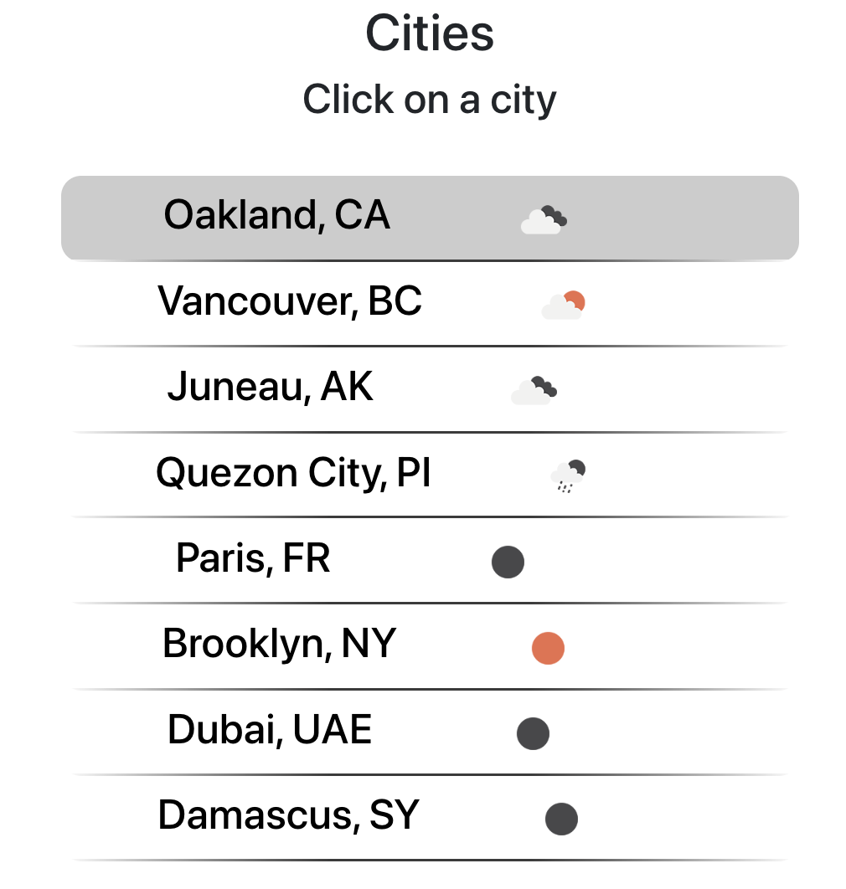

# openweather-proj

For this project, I practiced fetching data from the [Open Weather API](https://openweathermap.org/). Thanks to React, the view is dynamically updated based on the user's selection--just as though they were viewing their own weather app.

## The thing I’m most proud of:

Getting the weather icons to show at the first view. This meant I had to fetch each piece of weather data at the first render, and then updated the state of an array of objects.

## The trickiest parts:

- **Debugging**. In this fullstack app, I needed to check 3 different consoles for errors, as well as the network tab to check the status of my HTTP requests. One helpful tool I've found is the React tab in Chrome DevTools.

- **Getting the icons to work**. Debugging while fetching data caused me serious pain when I wound up making multiple infinite calls to the API due to passing in an incorrect argument within a useEffect(). Now I know why it’s super important to avoid infinite loops as a lot can happen in a matter of seconds to a minute.

## What I learned:

Setting up the fullstack app, fetching data from an API, how to change the view based on state, passing data from a child to a parent
ask clarifying questions super early on

